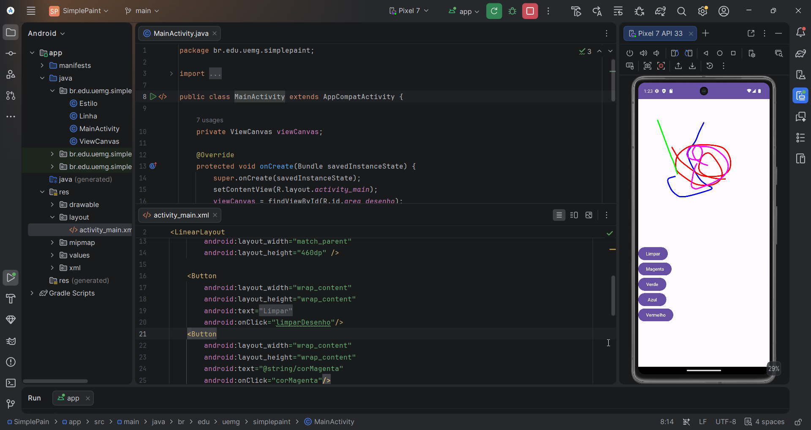

# SimplePaint 🎨

Aplicação Android desenvolvida em Java pelo Professor Eduardo e incrementada para desenho livre na tela (_canvas_), com seleção de cores e persistência dos traços.

Projeto acadêmico - **UEMG (Universidade do Estado de Minas Gerais)**.

---

## 📱 Demonstração

---

## ✨ Funcionalidades

- **Desenho Livre**: Desenho contínuo e suave utilizando `Canvas`, `Path` e `Paint`.
- **Persistência de Traços**: Permite alternar entre cores livremente sem apagar os desenhos anteriores da tela.
- **Paleta de Cores**:
    - 🟣 **Magenta**
    - 🟢 **Verde**
    - 🔵 **Azul**
    - 🔴 **Vermelho**
- **Limpeza do Canvas**: Botão **Limpar** para reiniciar o quadro de desenho.

---

## 🛠️ Tecnologias e Especificações

- **Linguagem**: Java
- **Plataforma**: Android
- **Compile SDK**: 33 (Android 13 - Tiramisu)
- **Target SDK**: 33
- **Min SDK**: 23 (Android 6.0 - Marshmallow)
- **JDK do Gradle**: Java 17 (JBR 17)
